# Cloud Library Management System

## Overview
Cloud Library is a web-based library management project created with HTML, CSS and JavaScript.
The project allows users to browse and search books, view and search members, add members, manage borrowing information and view a simple dashboard.
The application is deployed on AWS using Amazon S3 and Amazon CloudFront. The S3 bucket stores the static website files and remains private, while CloudFront securely delivers the website to users.

## Features
- Responsive navigation
- Book catalog
- Book search
- Member management page
- Borrowing page
- Dashboard page
- Responsive design
- JavaScript interaction

## Technologies Used
- HTML 5
- CSS 3
- JavaScript
- Git
- GitHub
- Amazon S3
- Amazon CloudFront
- Terraform
- AWS CLI

## AWS Architecture Diagram

The Cloud Library application is hosted on AWS using Amazon S3 and CloudFront. GitHub Actions provides automated CI/CD deployment using secure AWS IAM OIDC authentication, while Terraform provisions and manages the cloud infrastructure.
Amazon CloudWatch monitors CloudFront 5xx errors and Amazon SNS provides alert notifications.

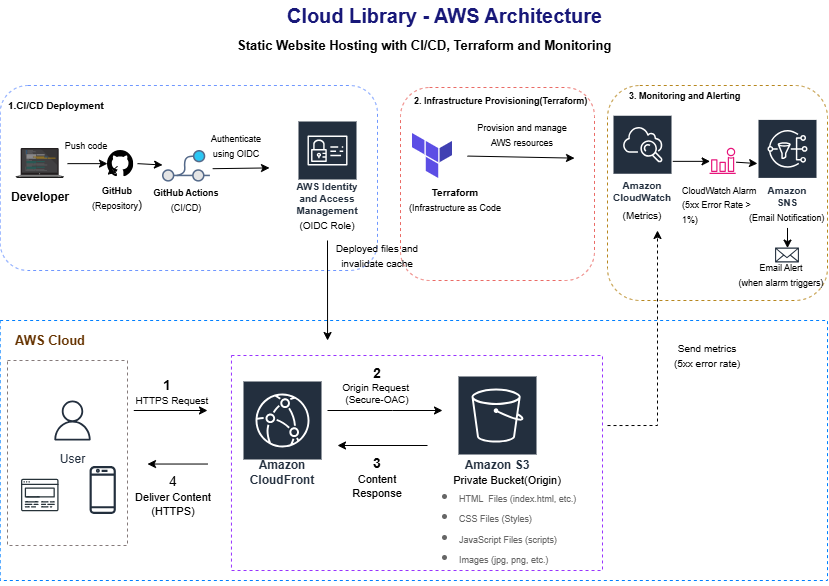

## AWS Cloud Deployment

The Cloud Library website is deployed on AWS as a static web application.

## AWS Services

- **Amazon S3** - Stores the HTML, CSS, JavaScript and image files.
- **Amazon CloudFront** - Delivers the website securely through the AWS global edge network.
- **S3 Block Public Access** - Keeps the S3 bucket private.
- **CloudFront access to S3** - Allows CloudFront to retrieve website objects from the private S3 bucket.

## Architecture

User --> Amazon CloudFront --> Private Amazon S3 Bucket --> Website Files

### Deployment Highlights

- Uploaded the static website files to Amazon S3.
- Configured the S3 bucket with Block Public Access enabled.
- Configured a bucket policy allowing CloudFront to retrieve S3 objects.
- Created an Amazon CloudFront distribution.
- Configured `index.html` as the default root object.
- Successfully delivered the website through the CloudFront domain.

## AWS Deployment Screenshots
#### Live Website via Amazon CloudFront

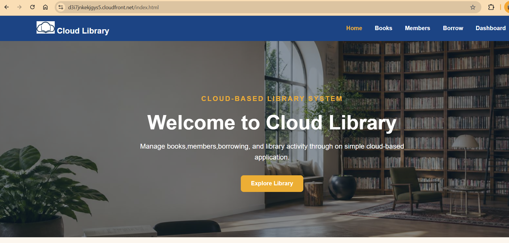

#### Website Files Stored in Amazon S3

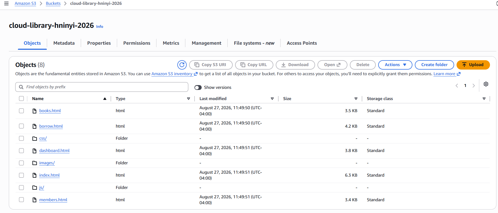

#### Private S3 Bucket

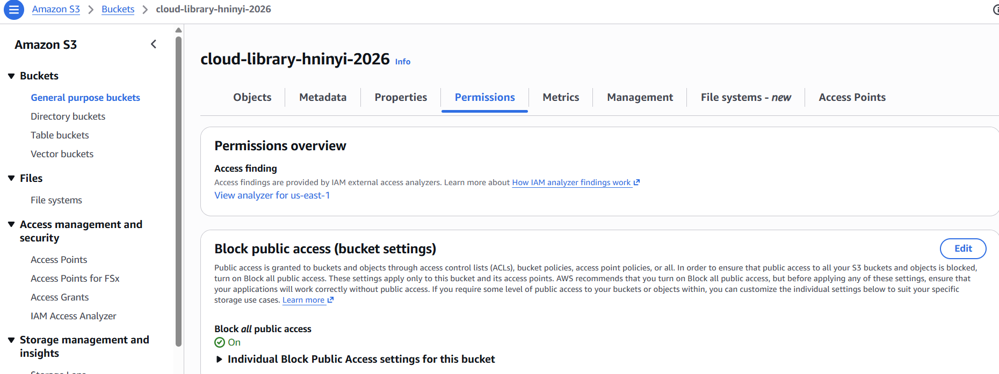

#### Amazon CloudFront Distribution

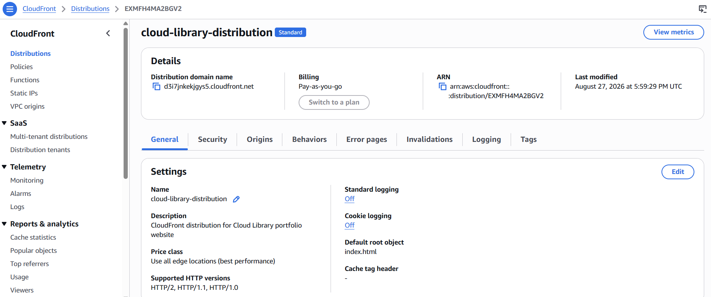

## Project Pages
- `index.html` - Home page
- `books.html` - Book catalog
- `members.html` - Member management
- `borrow.html` - Borrowing page
- `dashboard.html` - Library dashboard

## Infrastructure as Code with Terraform

Terraform is used in this project to provision and manage the AWS infrastructure for the Cloud Library application.

### AWS Resources Managed by Terraform

- Amazon S3 bucket for website files
- S3 Block Public Access for bucket security
- S3 Bucket Ownership Controls
- S3 Versioning
- Amazon CloudFront Origin Access Control (OAC)
- Amazon CloudFront distribution
- S3 bucket policy allowing secure access from CloudFront
- Terraform output for the CloudFront domain name

### Terraform Workflow

The following Terraform commands were used to build and verify the infrastructure:

```bash
terraform init
terraform fmt
terraform validate
terraform plan
terraform apply
```
After deployment, `terraform plan` was run again to verify that the AWS infrastructure matched the Terraform configuration.

## Secure Architecture

The S3 bucket is not publicly accessible. CloudFront accesses the private S3 bucket through Origin Access Control (OAC). Users access the Cloud Library website through the CloudFront distribution.

```text
User / Browser
    |
    |
Amazon CloudFront
    |
    | Origin Access Control (OAC)
    |
Private Amazon S3 Bucket
    |
    |
HTML/CSS/JavaScript/Images
```
### Terraform Deployment

**Terraform configuration**

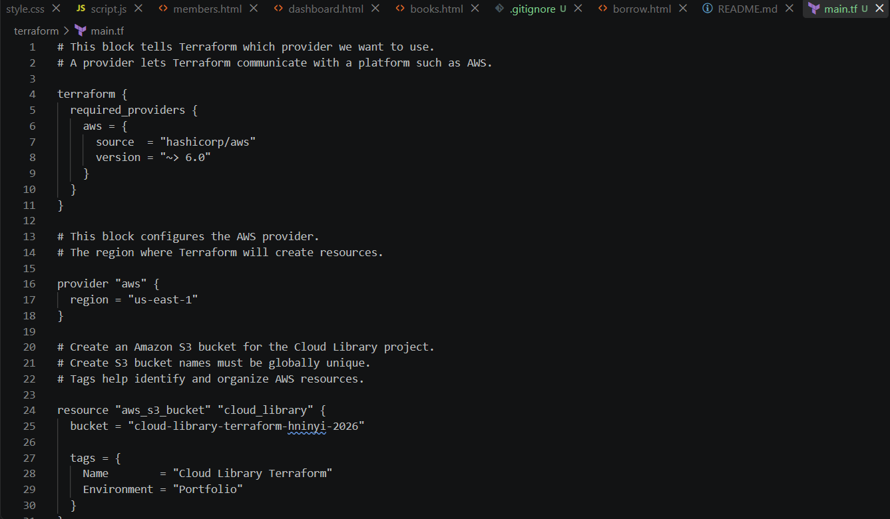

**Terraform deployment**

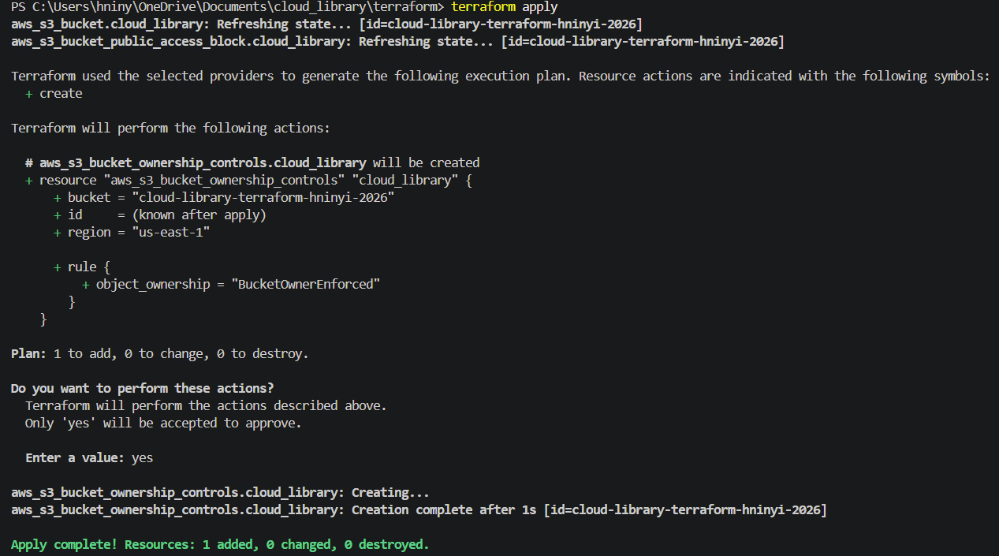

**Final Terraform verification**

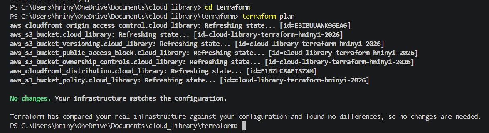

**Application deployed through Terraform-managed CloudFront**

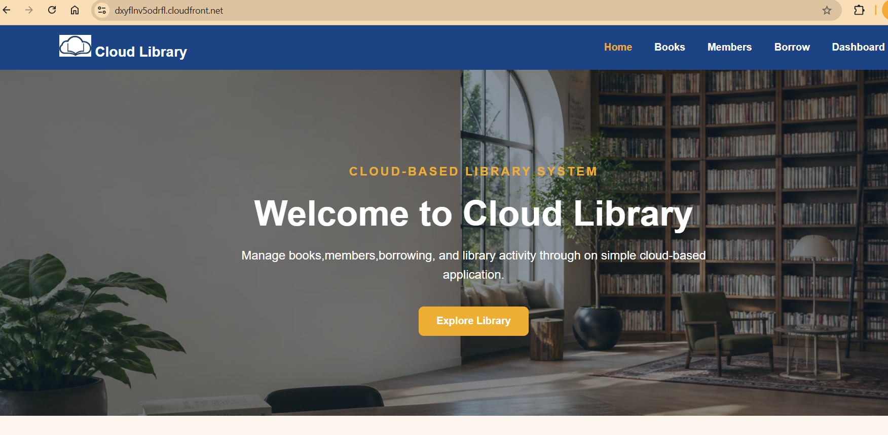

### Terraform Files
The Terraform configuration is located in the [`terraform`](terraform/) directory.
Terraform state files, local provider files, variable files and plan files are excluded from GitHub using `.gitignore`.

## CI/CD Pipeline
This project uses GitHub Actions to automatically deploy website updates to Amazon S3 whenever changes to push to the `main` branch.
GitHub Actions authenticates securely to AWS using OIDC and an IAM role, avoiding permanent AWS access keys.
After deployment, the workflow automatically creates a CloudFront cache invalidation so the latest version of the website is served.

Deployment flow:
Developer --> GitHub --> GitHub Actions --> AWS IAM/OIDC --> Amazon S3 --> CloudFront Invalidation --> Users

## Monitoring
Amazon CloudWatch is used to monitor the CloudFront distribution, including request traffic, cache performance and HTTP error rates.
A CloudWatch alarm is configured to detect elevated 5xx errors so potential availability issues can be identified quickly.

**CloudWatch Alarm Details**

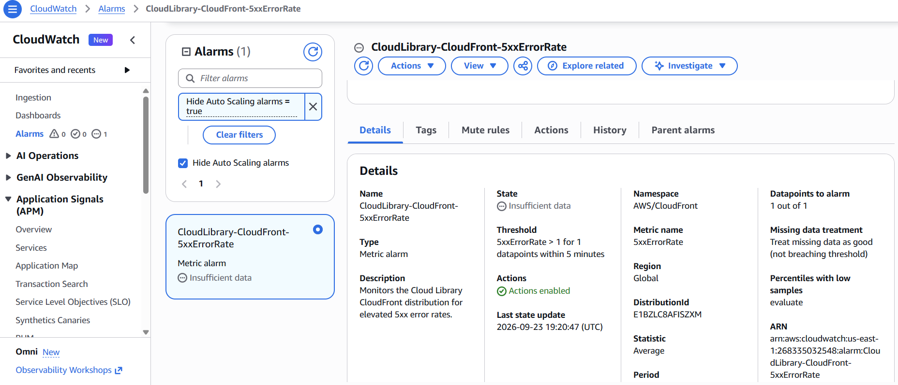

**CloudWatch Monitoring View**

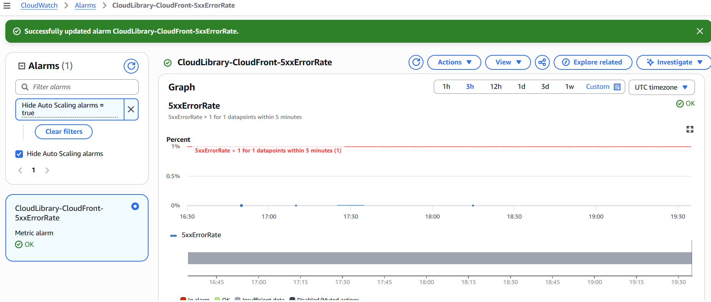

## Project Structure
```text
cloud_library/
|
|-- .github/
|--  workflows/
|   |--deploy.yml
|    
|-- css/
|   |-- style.css
|
|-- images/
|
|-- js/
|   |-- script.js
|
|-- screenshots/
|   |-- 01-s3-bucket-created.png
    |-- 02-s3-upload-success.png
    |-- 03-s3-project-objects.png
    |-- 04-cloudfront-live-website.png
    |-- 05-s3-block-public-access.png
    |-- 06-s3-cloudfront-bucket-policy.png
    |-- 07-cloudfront-distribution.png
    |-- s3-versioning-enabled.png
    |-- terraform-apply-success.png
    |-- terraform-cloudfront-apply.png
    |-- terraform-cloudfront-live-website.png
    |-- terraform-main-code.png
    |-- terraform-plan-no-changes.png
    |-- terraform-plan.png
|
|-- architecture/
|   |-- cloud-library-aws-architecture.drawio
    |-- cloud--library-aws-architecture.png
|
|-- terraform/
|   |-- main.tf
    |-- .terraform.lock.hcl
|    
|-- index.html
|-- books.html
|-- members.html
|-- borrow.html
|-- dashboard.html
|-- README.md
|-- .gitignore
```

